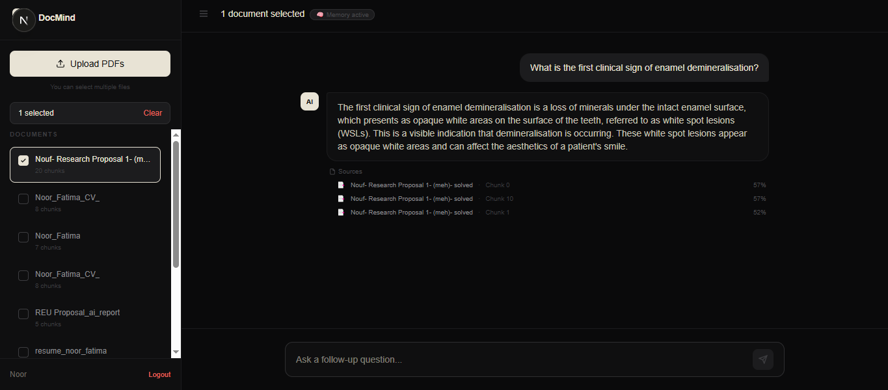
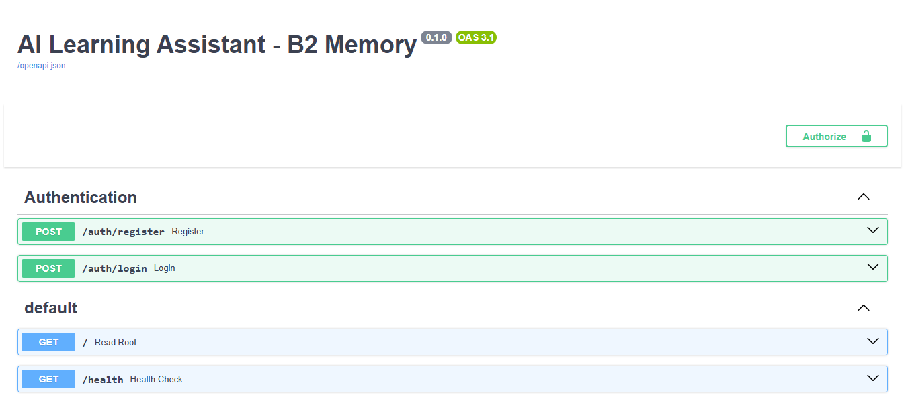
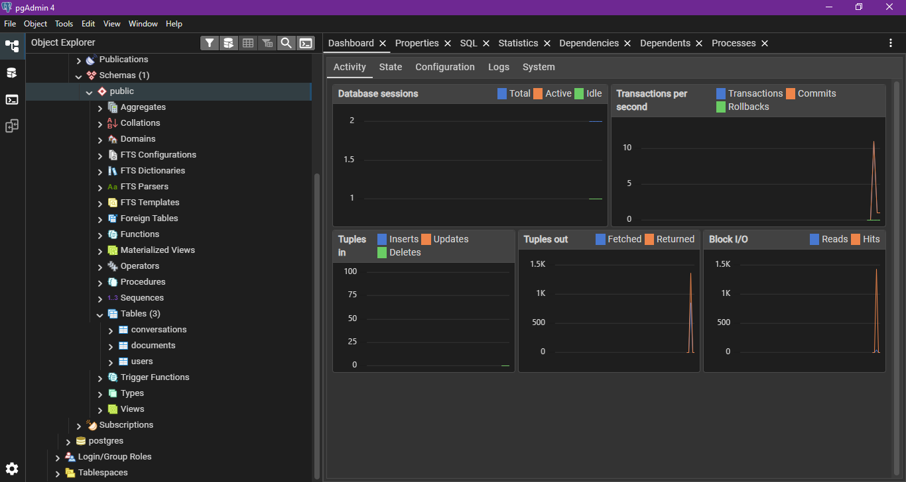

# DocMind: AI Document Q&A with Source Citations

DocMind lets you upload PDFs and chat with them. Questions are answered by a **retrieval-augmented generation (RAG)** pipeline: documents are split into chunks, embedded, indexed in FAISS, and the most relevant passages are passed to an LLM, which answers with **citations showing exactly which document and chunk each answer came from**.

## Features

- **Multi-document chat**: upload several PDFs and query one, some, or all of them.
- **Source citations**: every answer lists the supporting documents, chunk IDs and similarity scores.
- **Conversation memory**: follow-up questions use earlier chat history.
- **Two retrieval modes**: semantic search (FAISS + sentence embeddings) and a TF-IDF keyword fallback.
- **User accounts**: JWT-based registration and login; each user only sees their own documents.
- **Persistent index**: the FAISS index is saved to disk and reloaded on startup.

## Architecture

```
PDF upload -> text extraction (pdfplumber) -> chunking (200 words, 30 overlap)
          -> embeddings (all-MiniLM-L6-v2) -> FAISS vector index
                                   |
Question -> embed -> top-k similar chunks -> LLM (Groq) -> answer + sources
```

| Layer | Technology |
|---|---|
| Frontend | Next.js 16, React 19, Tailwind CSS, TanStack Query |
| Backend | FastAPI, SQLAlchemy, Pydantic |
| Retrieval | FAISS, sentence-transformers (`all-MiniLM-L6-v2`), TF-IDF |
| Databases | PostgreSQL (users, documents, conversations), MongoDB (chunks) |
| Auth | JWT |
| LLM | Groq API |

## Screenshots

**Chat with sources**



**API documentation (Swagger)**



**PostgreSQL schema**



## API overview

| Method | Endpoint | Description |
|---|---|---|
| `POST` | `/auth/register`, `/auth/login` | Create an account / get a token |
| `POST` | `/upload` | Upload and index a PDF |
| `POST` | `/query` | Ask a question across selected documents |
| `GET` | `/documents` | List the current user's documents |
| `GET` | `/profile` | Current user profile |
| `GET` | `/faiss-stats` | Index size and embedding model |

## Getting started

**Prerequisites:** Python 3.10+, Node.js 18+, PostgreSQL, a MongoDB instance, and a Groq API key.

```bash
# Backend
cd backend
pip install -r requirements.txt
cp .env.example .env        # add your own values
uvicorn main:app --reload   # http://localhost:8000/docs

# Frontend
cd ai-frontend
npm install
npm run dev                 # http://localhost:3000
```

## Author

**Noor Fatima**: [GitHub](https://github.com/noorfatima1123) · [LinkedIn](https://www.linkedin.com/in/engr-noor-fatima-a4a142290)
